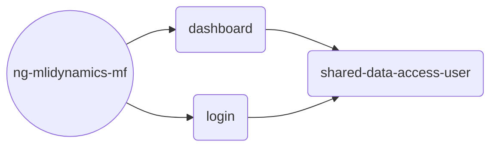

# NgMlidynamicsMf
Template @MLI Dynamics for MFE (micro front ends). This is an angular micro front end using Nx build tool chain with Okta signon.
## Create the workspace
> npx create-nx-workspace ng-mlidynamics-mf
## Install generator
cd to workspace **ng-mlidynamics-mf**
> npm install --save-dev @nrwl/angular
## Create host or shell
> npx nx g @nrwl/angular:host dashboard
## Create mfe (micro front end)
> npx nx g @nrwl/angular:remote login --host=dashboard
## Create shared library
> nx g @nrwl/angular:lib shared/data-access-user
## Nx graph

**Note** Dynamically load remote modules
Add import
> import { loadRemoteModule } from '@nrwl/angular/mf';

Add into Route
> { path: 'login', loadChildren: () =>  loadRemoteModule('login', './Module').then( (m) => m.RemoteEntryModule ), }

**Reference**
1. Shared Libraries as singleton - example Okta services - 
	- [Webpack plugins | Nx](https://nx.dev/packages/webpack/documents/webpack-plugins)
	- [ModuleFederationPlugin | webpack](https://webpack.js.org/plugins/module-federation-plugin/#sharing-hints)
	- [Mfe angular application to share external npm packages Nx workspace · Issue #10997 · nrwl/nx (github.com)](https://github.com/nrwl/nx/issues/10997)
2. Okta
	- [Okta CLI | The easiest way to get started with Okta!](https://cli.okta.com/)